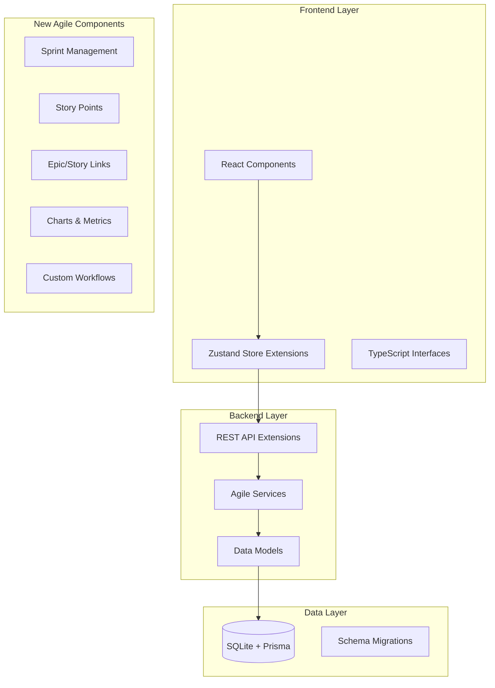

# Design Document: Agile Methodology Support

## Overview

This design extends the existing Trello-like kanban board application to support Agile, Scrum, and Kanban methodologies. The enhancement provides optional advanced project management capabilities while maintaining backward compatibility with existing boards and workflows.

The system will be built as a modular extension to the current React/TypeScript frontend and Node.js/SQLite backend, ensuring that teams can gradually adopt Agile features without disrupting existing workflows.

## Architecture

### High-Level Architecture

The Agile methodology support will be implemented as a layered enhancement:



### Integration Strategy

The design follows a non-breaking extension pattern:
- Existing board functionality remains unchanged
- New Agile features are opt-in per board
- Database schema extends existing tables with nullable columns
- API endpoints are additive, not replacing existing ones

## Components and Interfaces

### Frontend Components

#### Board Template Selection
```typescript
interface BoardTemplate {
  id: string;
  name: 'basic' | 'kanban' | 'scrum';
  displayName: string;
  description: string;
  defaultColumns: ColumnTemplate[];
  enabledFeatures: AgileFeature[];
}

interface ColumnTemplate {
  name: string;
  position: number;
  workflowStatus?: string;
}
```

#### Sprint Management
```typescript
interface Sprint {
  id: string;
  boardId: string;
  name: string;
  goal?: string;
  startDate: Date;
  endDate: Date;
  status: 'planning' | 'active' | 'completed';
  capacity?: number; // story points
  createdAt: Date;
  updatedAt: Date;
}

interface SprintCard {
  sprintId: string;
  cardId: string;
  addedAt: Date;
  completedAt?: Date;
  storyPoints?: number;
}
```

#### Story Points and Estimation
```typescript
interface StoryPointsConfig {
  boardId: string;
  enabled: boolean;
  scale: number[]; // [1, 2, 3, 5, 8, 13, 21, 34, 55, 89]
  requireEstimation: boolean;
}

interface CardEstimation {
  cardId: string;
  storyPoints?: number;
  originalEstimate?: number; // hours
  timeSpent: number; // hours
  remainingEstimate?: number; // hours
}
```

#### Epic and Story Hierarchy
```typescript
interface EpicLink {
  id: string;
  epicId: string; // parent card
  storyId: string; // child card
  createdAt: Date;
}

interface EpicProgress {
  epicId: string;
  totalStories: number;
  completedStories: number;
  totalStoryPoints: number;
  completedStoryPoints: number;
  progressPercentage: number;
}
```

### Backend Services

#### Sprint Service
```typescript
class SprintService {
  async createSprint(boardId: string, sprintData: CreateSprintDto): Promise<Sprint>
  async getActiveSprint(boardId: string): Promise<Sprint | null>
  async addCardsToSprint(sprintId: string, cardIds: string[]): Promise<void>
  async completeSprint(sprintId: string): Promise<Sprint>
  async getSprintBurndown(sprintId: string): Promise<BurndownData[]>
  async calculateVelocity(boardId: string, sprintCount?: number): Promise<VelocityData>
}
```

#### Estimation Service
```typescript
class EstimationService {
  async updateStoryPoints(cardId: string, points: number): Promise<void>
  async logTimeEntry(cardId: string, timeSpent: number, description?: string): Promise<TimeEntry>
  async getCardTimeTracking(cardId: string): Promise<TimeTrackingSummary>
  async calculateSprintCapacity(sprintId: string): Promise<number>
}
```

#### Reporting Service
```typescript
class ReportingService {
  async generateBurndownChart(sprintId: string): Promise<BurndownChartData>
  async calculateTeamVelocity(boardId: string, sprintCount: number): Promise<VelocityMetrics>
  async getSprintReport(sprintId: string): Promise<SprintReport>
  async getEpicProgress(epicId: string): Promise<EpicProgress>
}
```

## Data Models

### Database Schema Extensions

The design extends the existing schema with new tables and optional columns:

```sql
-- Board template and configuration
ALTER TABLE boards ADD COLUMN template_type VARCHAR(20) DEFAULT 'basic';
ALTER TABLE boards ADD COLUMN agile_config JSON;

-- Sprint management
CREATE TABLE sprints (
  id TEXT PRIMARY KEY,
  board_id TEXT NOT NULL REFERENCES boards(id) ON DELETE CASCADE,
  name TEXT NOT NULL,
  goal TEXT,
  start_date DATETIME NOT NULL,
  end_date DATETIME NOT NULL,
  status TEXT NOT NULL DEFAULT 'planning',
  capacity INTEGER,
  created_at DATETIME DEFAULT CURRENT_TIMESTAMP,
  updated_at DATETIME DEFAULT CURRENT_TIMESTAMP
);

-- Sprint-card relationships
CREATE TABLE sprint_cards (
  sprint_id TEXT NOT NULL REFERENCES sprints(id) ON DELETE CASCADE,
  card_id TEXT NOT NULL REFERENCES cards(id) ON DELETE CASCADE,
  added_at DATETIME DEFAULT CURRENT_TIMESTAMP,
  completed_at DATETIME,
  story_points INTEGER,
  PRIMARY KEY (sprint_id, card_id)
);

-- Story points and estimation
ALTER TABLE cards ADD COLUMN story_points INTEGER;
ALTER TABLE cards ADD COLUMN original_estimate INTEGER; -- hours
ALTER TABLE cards ADD COLUMN time_spent INTEGER DEFAULT 0; -- hours
ALTER TABLE cards ADD COLUMN remaining_estimate INTEGER; -- hours

-- Epic-story relationships
CREATE TABLE epic_links (
  id TEXT PRIMARY KEY,
  epic_id TEXT NOT NULL REFERENCES cards(id) ON DELETE CASCADE,
  story_id TEXT NOT NULL REFERENCES cards(id) ON DELETE CASCADE,
  created_at DATETIME DEFAULT CURRENT_TIMESTAMP,
  UNIQUE(epic_id, story_id)
);

-- Time tracking entries
CREATE TABLE time_entries (
  id TEXT PRIMARY KEY,
  card_id TEXT NOT NULL REFERENCES cards(id) ON DELETE CASCADE,
  user_id TEXT NOT NULL REFERENCES users(id) ON DELETE CASCADE,
  time_spent INTEGER NOT NULL, -- minutes
  description TEXT,
  logged_at DATETIME DEFAULT CURRENT_TIMESTAMP
);

-- Custom labels and priorities
CREATE TABLE labels (
  id TEXT PRIMARY KEY,
  board_id TEXT NOT NULL REFERENCES boards(id) ON DELETE CASCADE,
  name TEXT NOT NULL,
  color TEXT NOT NULL,
  created_at DATETIME DEFAULT CURRENT_TIMESTAMP
);

CREATE TABLE card_labels (
  card_id TEXT NOT NULL REFERENCES cards(id) ON DELETE CASCADE,
  label_id TEXT NOT NULL REFERENCES labels(id) ON DELETE CASCADE,
  PRIMARY KEY (card_id, label_id)
);

ALTER TABLE cards ADD COLUMN priority TEXT DEFAULT 'medium'; -- highest, high, medium, low, lowest
ALTER TABLE cards ADD COLUMN issue_type TEXT DEFAULT 'task'; -- story, bug, task, epic

-- Workflow definitions
CREATE TABLE workflows (
  id TEXT PRIMARY KEY,
  board_id TEXT NOT NULL REFERENCES boards(id) ON DELETE CASCADE,
  name TEXT NOT NULL,
  issue_types JSON NOT NULL, -- array of issue types this workflow applies to
  statuses JSON NOT NULL, -- array of status objects with transitions
  created_at DATETIME DEFAULT CURRENT_TIMESTAMP
);

-- Burndown tracking
CREATE TABLE burndown_snapshots (
  id TEXT PRIMARY KEY,
  sprint_id TEXT NOT NULL REFERENCES sprints(id) ON DELETE CASCADE,
  snapshot_date DATE NOT NULL,
  remaining_points INTEGER NOT NULL,
  completed_points INTEGER NOT NULL,
  total_points INTEGER NOT NULL,
  created_at DATETIME DEFAULT CURRENT_TIMESTAMP,
  UNIQUE(sprint_id, snapshot_date)
);
```

### Agile Configuration Schema

Each board will have an `agile_config` JSON field containing:

```typescript
interface AgileConfig {
  features: {
    sprints: boolean;
    storyPoints: boolean;
    epics: boolean;
    timeTracking: boolean;
    burndownCharts: boolean;
    customWorkflows: boolean;
    labels: boolean;
    priorities: boolean;
  };
  storyPointsScale: number[];
  defaultIssueType: string;
  requireEstimation: boolean;
  sprintDuration: number; // days
  workingDaysPerWeek: number;
}
```

## Correctness Properties

*A property is a characteristic or behavior that should hold true across all valid executions of a system-essentially, a formal statement about what the system should do. Properties serve as the bridge between human-readable specifications and machine-verifiable correctness guarantees.*

Let me analyze the acceptance criteria to determine which ones are testable as properties:

### Property 1: Board Template Configuration
*For any* board template selection, the created board should have the appropriate default columns and configuration settings that match the selected template type.
**Validates: Requirements 1.2, 1.3, 1.4, 1.5**

### Property 2: Sprint Lifecycle Management
*For any* sprint, transitioning through the lifecycle (planning → active → completed) should preserve all associated work items and enable creation of subsequent sprints.
**Validates: Requirements 2.4, 2.5**

### Property 3: Story Point Consistency
*For any* set of cards with story points, the total story points should remain consistent across card movements and sprint assignments.
**Validates: Requirements 3.3, 3.4**

### Property 4: Story Point Validation
*For any* story point assignment, only values from the Fibonacci sequence (1, 2, 3, 5, 8, 13, 21, 34, 55, 89) should be accepted.
**Validates: Requirements 3.2**

### Property 5: Epic-Story Relationship Integrity
*For any* epic-story link, the relationship should be visible and navigable from both the epic and story perspectives, and epic progress should accurately reflect story completion status.
**Validates: Requirements 4.2, 4.3, 4.4**

### Property 6: Epic Deletion Preservation
*For any* epic with linked stories, deleting the epic should preserve all child stories as independent cards without data loss.
**Validates: Requirements 4.5**

### Property 7: Backlog Item Positioning
*For any* new item added to a backlog, it should appear at the bottom of the backlog by default and support reordering through drag-and-drop operations.
**Validates: Requirements 5.2, 5.3**

### Property 8: Sprint Planning Workflow
*For any* backlog item, it should be movable to a sprint during sprint planning, and this movement should update both backlog and sprint contents appropriately.
**Validates: Requirements 5.5**

### Property 9: Burndown Chart Accuracy
*For any* active sprint, the burndown chart should accurately reflect remaining work, include both ideal and actual progress lines, and update dynamically when story points change.
**Validates: Requirements 6.1, 6.4, 6.5**

### Property 10: Burndown Data Persistence
*For any* completed sprint, the burndown chart data should be preserved for historical reference and remain accessible after sprint completion.
**Validates: Requirements 6.3**

### Property 11: Velocity Calculation Accuracy
*For any* set of completed sprints, the calculated velocity should accurately reflect the average story points completed per sprint over the specified time period.
**Validates: Requirements 7.1, 7.2**

### Property 12: Workflow Enforcement
*For any* card with a defined workflow, status transitions should only be allowed through valid workflow paths as defined in the custom workflow configuration.
**Validates: Requirements 8.3**

### Property 13: Issue Type Workflow Assignment
*For any* issue type, it should be possible to assign a specific workflow, and cards of that issue type should follow the assigned workflow rules.
**Validates: Requirements 8.4**

### Property 14: Label Assignment Flexibility
*For any* card, multiple labels should be assignable, and each label should maintain its color and name properties consistently across the system.
**Validates: Requirements 9.2**

### Property 15: Priority-Based Operations
*For any* set of cards with assigned priorities, sorting and filtering operations should correctly order cards according to priority levels (Highest, High, Medium, Low, Lowest).
**Validates: Requirements 9.4**

### Property 16: Time Tracking Aggregation
*For any* card, sprint, or epic with time entries, the total time spent should be accurately calculated from all individual time entries with proper timestamp preservation.
**Validates: Requirements 10.3, 10.4**

### Property 17: Time Tracking Method Equivalence
*For any* time tracking session, both manual entry and timer-based tracking should produce equivalent results when tracking the same duration.
**Validates: Requirements 10.2**

### Property 18: Feature Toggle Consistency
*For any* board with Agile features enabled or disabled, the UI should consistently show or hide related functionality, while preserving existing board functionality when features are enabled.
**Validates: Requirements 11.2, 11.3**

### Property 19: Data Preservation During Feature Changes
*For any* board where Agile features are disabled after use, all associated data should be preserved while functionality is hidden from the UI.
**Validates: Requirements 11.5**

### Property 20: Backward Compatibility Preservation
*For any* existing board when Agile features are not enabled, the system should function identically to the previous version without any behavioral changes.
**Validates: Requirements 12.1, 12.3**

### Property 21: Migration Data Integrity
*For any* existing board being upgraded to use Agile features, all existing boards, columns, and cards should be preserved without data loss during the migration process.
**Validates: Requirements 12.2, 12.4**

## Error Handling

### Sprint Management Errors
- **Invalid Sprint Dates**: Prevent creation of sprints with end dates before start dates
- **Overlapping Sprints**: Prevent creation of overlapping active sprints on the same board
- **Sprint Scope Changes**: Require explicit confirmation before modifying active sprint scope
- **Capacity Overflow**: Warn when adding cards to sprint exceeds estimated capacity

### Story Points Validation
- **Invalid Point Values**: Reject story point assignments outside the Fibonacci sequence
- **Negative Values**: Prevent assignment of negative or zero story points
- **Required Estimation**: Block sprint commitment when estimation is required but missing

### Epic-Story Hierarchy Errors
- **Circular References**: Prevent linking epics to themselves or creating circular dependencies
- **Invalid Links**: Reject attempts to link cards that don't exist or are already linked
- **Cross-Board Links**: Prevent linking cards across different boards

### Time Tracking Errors
- **Negative Time**: Reject negative time entries
- **Future Timestamps**: Prevent logging time entries with future timestamps
- **Concurrent Timers**: Prevent starting multiple timers for the same user simultaneously

### Workflow Validation
- **Invalid Transitions**: Block card status changes that violate workflow rules
- **Missing Workflows**: Provide default workflow when custom workflow is deleted
- **Orphaned Statuses**: Handle cards with statuses not present in updated workflows

## Testing Strategy

### Dual Testing Approach

The testing strategy employs both unit tests and property-based tests to ensure comprehensive coverage:

**Unit Tests** focus on:
- Specific examples of Agile feature functionality
- Integration points between new Agile components and existing board system
- Edge cases and error conditions specific to Agile workflows
- UI component behavior for Agile features

**Property-Based Tests** focus on:
- Universal properties that hold across all Agile configurations
- Data consistency across sprint lifecycles and epic hierarchies
- Calculation accuracy for story points, velocity, and burndown metrics
- Backward compatibility preservation across feature toggles

### Property-Based Testing Configuration

The system will use **fast-check** for TypeScript property-based testing with the following configuration:
- Minimum **100 iterations** per property test to ensure thorough coverage
- Each property test will be tagged with: **Feature: agile-methodology-support, Property {number}: {property_text}**
- Custom generators for Agile-specific data types (sprints, story points, epic hierarchies)
- Shrinking enabled to find minimal failing examples

### Testing Priorities

1. **Critical Path Testing**: Sprint management, story point calculations, and epic relationships
2. **Data Integrity Testing**: Migration scenarios and feature toggle operations
3. **Performance Testing**: Burndown chart generation and velocity calculations with large datasets
4. **Integration Testing**: Interaction between Agile features and existing board functionality
5. **Backward Compatibility Testing**: Ensuring existing boards remain unaffected

### Test Data Management

- **Isolated Test Environments**: Each test suite uses isolated database instances
- **Realistic Data Generators**: Property tests use generators that create realistic Agile scenarios
- **Migration Testing**: Dedicated tests for upgrading existing boards to Agile functionality
- **Cross-Feature Testing**: Tests that verify interactions between multiple Agile features

The testing approach ensures that the Agile methodology support maintains the reliability and performance of the existing system while providing robust new functionality.