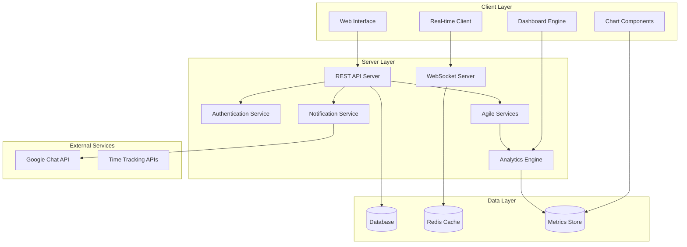

# Design Document: Trello Alternative with Agile/Scrum/Kanban Capabilities

## Overview

The Trello Alternative is a comprehensive project management application that scales from simple kanban boards to full Agile/Scrum project management. The system provides a Trello-like foundation with optional advanced features for Agile methodologies, Scrum ceremonies, Kanban optimization, and comprehensive project analytics.

**Core Philosophy**: All advanced features are **optional and configurable per board**. Users start with familiar Trello-like functionality and can progressively enable Agile/Scrum/Kanban features as needed. This ensures backward compatibility while providing enterprise-level project management capabilities.

**Feature Tiers**:
- **Basic Tier**: Traditional kanban boards with columns, cards, and real-time collaboration
- **Kanban Enhanced**: WIP limits, cycle time tracking, cumulative flow diagrams
- **Agile/Scrum**: Sprint management, story points, epics, burndown charts, velocity tracking
- **Enterprise**: Advanced workflows, custom dashboards, time tracking, release management

The application follows a client-server architecture with real-time synchronization, secure user authentication, and a responsive web interface that supports drag-and-drop interactions for intuitive task management.

## Architecture

### High-Level Architecture



### Technology Stack

**Frontend:**
- Modern web framework (React/Vue.js) with TypeScript
- Real-time communication via WebSockets
- Drag-and-drop library (react-beautiful-dnd or @hello-pangea/dnd)
- State management for real-time synchronization
- Chart libraries for analytics (Chart.js, D3.js, or Recharts)
- Date/time libraries for sprint and time tracking

**Backend:**
- RESTful API server with WebSocket support
- JWT-based authentication
- Real-time event broadcasting
- Google Chat webhook integration
- Background job processing for analytics
- Time tracking and metrics calculation services

**Database:**
- Relational database for persistent data
- Redis for real-time session management and caching
- Time-series data storage for metrics and analytics
- Optimized indexing for reporting queries

**Optional Integrations:**
- External time tracking services
- CI/CD pipeline integrations
- Third-party authentication providers
- Business intelligence tools

## Components and Interfaces

### Core Components

#### 1. Authentication System
- **User Registration/Login**: Minimal signup with username/email and encrypted password
- **Session Management**: JWT tokens with secure refresh mechanism
- **Password Security**: Bcrypt hashing with salt rounds

#### 2. Board Management System
- **Board Controller**: CRUD operations for boards
- **Template System**: Standard board templates with customizable structure
- **Permission System**: Role-based access control (owner, admin, edit, view)
- **Feature Configuration**: Per-board settings for enabling Agile/Scrum/Kanban features

#### 3. Real-time Collaboration Engine
- **WebSocket Manager**: Handles real-time connections and message broadcasting
- **Event System**: Publishes board changes to all connected clients
- **Conflict Resolution**: Handles concurrent edits gracefully

#### 4. Drag-and-Drop Interface
- **Card Movement**: Smooth drag-and-drop between lists and swim lanes
- **Position Calculation**: Maintains card order and swim lane assignments
- **Visual Feedback**: Real-time position updates for all users

#### 5. Notification System
- **Subscription Manager**: Tracks user subscriptions to cards
- **Google Chat Integration**: Webhook-based message delivery
- **Event Processor**: Formats and sends notifications based on card changes

#### 6. Agile/Scrum Management (Optional)
- **Sprint Controller**: Sprint creation, management, and lifecycle tracking
- **Story Point Manager**: Estimation, planning poker, velocity calculations
- **Epic Hierarchy**: Epic-story relationships and progress tracking
- **Ceremony Support**: Sprint planning, daily standup, retrospective tools

#### 7. Kanban Enhancement Engine (Optional)
- **WIP Limit Manager**: Column capacity management and enforcement
- **Flow Analytics**: Cycle time, lead time, and throughput calculations
- **Bottleneck Detection**: Automated flow analysis and recommendations

#### 8. Advanced Card System (Optional)
- **Issue Type Manager**: Story, Bug, Task, Epic, Sub-task classification
- **Relationship Engine**: Parent-child, blocking, dependency management
- **Workflow Engine**: Custom states, transitions, and approval processes

#### 9. Analytics and Reporting (Optional)
- **Metrics Calculator**: Real-time calculation of Agile and Kanban metrics
- **Chart Generator**: Burndown, velocity, cumulative flow diagrams
- **Dashboard Builder**: Configurable widgets and custom dashboards
- **Export Engine**: Report generation and data export capabilities

#### 10. Time Tracking System (Optional)
- **Work Log Manager**: Time entry, estimation vs actual tracking
- **Timesheet Generator**: Automated timesheet creation
- **Billing Integration**: Support for billing and invoicing workflows

#### 11. Release Management (Optional)
- **Version Controller**: Release planning and version management
- **Release Notes Generator**: Automated release documentation
- **Deployment Tracker**: Release calendar and deployment status

### API Interfaces

#### Authentication Endpoints
```
POST /api/auth/register
POST /api/auth/login
POST /api/auth/refresh
POST /api/auth/logout
```

#### Board Management Endpoints
```
GET /api/boards
POST /api/boards
GET /api/boards/:id
PUT /api/boards/:id
DELETE /api/boards/:id
POST /api/boards/:id/invite
PUT /api/boards/:id/members/:userId
PUT /api/boards/:id/features - Enable/disable optional features
GET /api/boards/:id/features - Get enabled features
```

#### Card Management Endpoints
```
GET /api/boards/:boardId/cards
POST /api/boards/:boardId/cards
PUT /api/cards/:id
DELETE /api/cards/:id
POST /api/cards/:id/subscribe
DELETE /api/cards/:id/subscribe
PUT /api/cards/:id/estimate - Set story points
POST /api/cards/:id/worklog - Add time tracking entry
```

#### Sprint Management Endpoints (Optional)
```
GET /api/boards/:boardId/sprints
POST /api/boards/:boardId/sprints
PUT /api/sprints/:id
DELETE /api/sprints/:id
POST /api/sprints/:id/start
POST /api/sprints/:id/complete
GET /api/sprints/:id/burndown
GET /api/sprints/:id/velocity
```

#### Epic Management Endpoints (Optional)
```
GET /api/boards/:boardId/epics
POST /api/boards/:boardId/epics
PUT /api/epics/:id
DELETE /api/epics/:id
POST /api/epics/:id/stories/:storyId
DELETE /api/epics/:id/stories/:storyId
GET /api/epics/:id/progress
```

#### Analytics Endpoints (Optional)
```
GET /api/boards/:boardId/analytics/cycle-time
GET /api/boards/:boardId/analytics/lead-time
GET /api/boards/:boardId/analytics/cumulative-flow
GET /api/boards/:boardId/analytics/throughput
GET /api/boards/:boardId/analytics/wip-aging
GET /api/teams/:teamId/velocity
GET /api/teams/:teamId/burndown
```

#### Workflow Management Endpoints (Optional)
```
GET /api/boards/:boardId/workflows
POST /api/boards/:boardId/workflows
PUT /api/workflows/:id
DELETE /api/workflows/:id
POST /api/cards/:id/transition/:transitionId
```

#### Dashboard Endpoints (Optional)
```
GET /api/dashboards
POST /api/dashboards
PUT /api/dashboards/:id
DELETE /api/dashboards/:id
GET /api/dashboards/:id/widgets
POST /api/dashboards/:id/widgets
```

#### Real-time WebSocket Events
```
board:join - Join board for real-time updates
board:leave - Leave board updates
card:moved - Card position changed
card:updated - Card content modified
card:created - New card added
card:deleted - Card removed
user:typing - User typing indicator
sprint:started - Sprint lifecycle events
sprint:completed - Sprint completion
wip:limit:exceeded - WIP limit violations
analytics:updated - Real-time metrics updates
```

## Data Models

### Core Models

### User Model
```typescript
interface User {
  id: string
  username: string
  email: string
  passwordHash: string
  preferences: UserPreferences
  createdAt: Date
  updatedAt: Date
}

interface UserPreferences {
  notifications: NotificationPreferences
  defaultEstimationUnit: 'hours' | 'story_points' | 'days'
  timezone: string
  workingHours: WorkingHours
}

interface WorkingHours {
  hoursPerDay: number
  workingDays: number[]
  startTime: string
  endTime: string
}
```

### Board Model
```typescript
interface Board {
  id: string
  name: string
  description?: string
  ownerId: string
  columns: Column[]
  swimLanes: SwimLane[]
  inviteToken: string
  features: BoardFeatures
  settings: BoardSettings
  createdAt: Date
  updatedAt: Date
}

interface BoardFeatures {
  agileEnabled: boolean
  sprintManagement: boolean
  storyPoints: boolean
  epicHierarchy: boolean
  wipLimits: boolean
  cycleTimeTracking: boolean
  cumulativeFlowDiagrams: boolean
  customWorkflows: boolean
  timeTracking: boolean
  releaseManagement: boolean
  advancedReporting: boolean
}

interface BoardSettings {
  estimationScale: number[]
  defaultIssueType: string
  autoAssignOwner: boolean
  requireEstimation: boolean
  wipLimitEnforcement: 'strict' | 'warning' | 'none'
  cycleTimeStartColumn: string
  cycleTimeEndColumn: string
}
```

### Column Model
```typescript
interface Column {
  id: string
  boardId: string
  name: string
  position: number
  color?: string
  wipLimit?: number
  columnType: 'backlog' | 'active' | 'done' | 'custom'
  workflowStates: string[]
}
```

### SwimLane Model
```typescript
interface SwimLane {
  id: string
  boardId: string
  name: string
  position: number
  category: 'priority' | 'team' | 'project' | 'epic' | 'custom'
  color?: string
  epicId?: string
}
```

### Card Model
```typescript
interface Card {
  id: string
  boardId: string
  columnId: string
  swimLaneId?: string
  title: string
  description?: string
  position: number
  dueDate?: Date
  labels: Label[]
  attachments: Attachment[]
  customFields: CustomField[]
  assignedUsers: string[]
  createdBy: string
  
  // Agile/Scrum fields (optional)
  issueType: IssueType
  storyPoints?: number
  epicId?: string
  parentId?: string
  sprintId?: string
  priority: Priority
  
  // Time tracking (optional)
  originalEstimate?: number
  remainingEstimate?: number
  timeSpent?: number
  workLogs: WorkLog[]
  
  // Workflow (optional)
  workflowState?: string
  resolution?: string
  
  // Relationships (optional)
  blockedBy: string[]
  blocks: string[]
  relatedTo: string[]
  
  // Metrics
  cycleTimeStart?: Date
  cycleTimeEnd?: Date
  leadTimeStart?: Date
  
  createdAt: Date
  updatedAt: Date
}

interface IssueType {
  id: string
  name: string
  icon: string
  color: string
  isSubtask: boolean
}

interface Priority {
  id: string
  name: string
  level: number
  color: string
}

interface WorkLog {
  id: string
  userId: string
  timeSpent: number
  description?: string
  date: Date
  createdAt: Date
}
```

### Agile/Scrum Models (Optional)

### Sprint Model
```typescript
interface Sprint {
  id: string
  boardId: string
  name: string
  goal?: string
  startDate: Date
  endDate: Date
  status: 'planning' | 'active' | 'completed' | 'cancelled'
  capacity: number
  commitment: number
  velocity?: number
  burndownData: BurndownPoint[]
  retrospectiveNotes?: string
  createdAt: Date
  updatedAt: Date
}

interface BurndownPoint {
  date: Date
  remainingWork: number
  idealRemaining: number
}
```

### Epic Model
```typescript
interface Epic {
  id: string
  boardId: string
  title: string
  description?: string
  status: 'planning' | 'in_progress' | 'done' | 'cancelled'
  startDate?: Date
  targetDate?: Date
  progress: EpicProgress
  stories: string[]
  color?: string
  createdBy: string
  createdAt: Date
  updatedAt: Date
}

interface EpicProgress {
  totalStories: number
  completedStories: number
  totalStoryPoints: number
  completedStoryPoints: number
  percentComplete: number
}
```

### Planning Poker Session Model
```typescript
interface PlanningPokerSession {
  id: string
  cardId: string
  facilitatorId: string
  status: 'active' | 'completed' | 'cancelled'
  estimates: PlanningPokerEstimate[]
  finalEstimate?: number
  createdAt: Date
  updatedAt: Date
}

interface PlanningPokerEstimate {
  userId: string
  estimate: number
  confidence: 'low' | 'medium' | 'high'
  submittedAt: Date
}
```

### Workflow Models (Optional)

### Workflow Model
```typescript
interface Workflow {
  id: string
  boardId: string
  name: string
  description?: string
  states: WorkflowState[]
  transitions: WorkflowTransition[]
  isDefault: boolean
  issueTypes: string[]
  createdAt: Date
  updatedAt: Date
}

interface WorkflowState {
  id: string
  name: string
  category: 'to_do' | 'in_progress' | 'done'
  color?: string
  position: number
}

interface WorkflowTransition {
  id: string
  name: string
  fromStateId: string
  toStateId: string
  conditions: TransitionCondition[]
  validators: TransitionValidator[]
  postFunctions: PostFunction[]
}

interface TransitionCondition {
  type: 'user_role' | 'field_value' | 'custom'
  configuration: any
}
```

### Analytics Models (Optional)

### Metrics Model
```typescript
interface BoardMetrics {
  id: string
  boardId: string
  date: Date
  
  // Kanban metrics
  cycleTime: MetricValue
  leadTime: MetricValue
  throughput: MetricValue
  wipCount: number
  
  // Agile metrics
  velocity: MetricValue
  burndownRate: number
  sprintProgress: number
  
  // Flow metrics
  cumulativeFlowData: CumulativeFlowPoint[]
  
  createdAt: Date
}

interface MetricValue {
  average: number
  median: number
  percentile85: number
  percentile95: number
  min: number
  max: number
}

interface CumulativeFlowPoint {
  date: Date
  columnId: string
  cardCount: number
}
```

### Dashboard Models (Optional)

### Dashboard Model
```typescript
interface Dashboard {
  id: string
  name: string
  description?: string
  ownerId: string
  isPublic: boolean
  widgets: DashboardWidget[]
  layout: DashboardLayout
  createdAt: Date
  updatedAt: Date
}

interface DashboardWidget {
  id: string
  type: 'burndown' | 'velocity' | 'cumulative_flow' | 'cycle_time' | 'custom'
  title: string
  configuration: WidgetConfiguration
  position: WidgetPosition
}

interface WidgetConfiguration {
  boardIds: string[]
  timeRange: string
  chartType: string
  filters: any
  refreshInterval: number
}

interface WidgetPosition {
  x: number
  y: number
  width: number
  height: number
}
```

### Release Management Models (Optional)

### Release Model
```typescript
interface Release {
  id: string
  boardId: string
  name: string
  description?: string
  version: string
  startDate?: Date
  releaseDate?: Date
  status: 'planning' | 'in_progress' | 'released' | 'cancelled'
  epics: string[]
  stories: string[]
  releaseNotes?: string
  createdBy: string
  createdAt: Date
  updatedAt: Date
}
```

### Existing Models (Enhanced)

### BoardMember Model
```typescript
interface BoardMember {
  id: string
  boardId: string
  userId: string
  role: 'owner' | 'admin' | 'edit' | 'view'
  permissions: MemberPermissions
  joinedAt: Date
}

interface MemberPermissions {
  canManageSprints: boolean
  canManageEpics: boolean
  canManageWorkflows: boolean
  canViewAnalytics: boolean
  canManageReleases: boolean
}
```

### CardSubscription Model
```typescript
interface CardSubscription {
  id: string
  cardId: string
  userId: string
  subscriptionType: 'all' | 'comments' | 'status_changes' | 'assignments'
  createdAt: Date
}
```

### CustomField Model
```typescript
interface CustomField {
  id: string
  cardId: string
  name: string
  type: 'text' | 'number' | 'date' | 'boolean' | 'select' | 'multi_select' | 'user' | 'epic_link'
  value: any
  options?: string[]
  required: boolean
}
```

## Correctness Properties

*A property is a characteristic or behavior that should hold true across all valid executions of a system—essentially, a formal statement about what the system should do. Properties serve as the bridge between human-readable specifications and machine-verifiable correctness guarantees.*

### Core Functionality Properties

### Property 1: Board Creation with Standard Template
*For any* valid board name and user, creating a new board should result in a board with that exact name and default columns (To Do, In Progress, Done) in the correct order.
**Validates: Requirements 1.1, 1.2**

### Property 2: Board Data Persistence
*For any* board data (name, columns, cards, settings), after storing the data and simulating a session restart, retrieving the board should return identical data.
**Validates: Requirements 1.5, 8.1**

### Property 3: Multi-Board Access
*For any* user with multiple boards, querying the user's boards should return all boards they have access to with correct permissions.
**Validates: Requirements 1.3**

### Property 4: Board Customization Persistence
*For any* board settings and appearance customizations, applying these changes should result in the board reflecting all customizations accurately.
**Validates: Requirements 1.4**

### Property 5: Column Management Operations
*For any* board and column operations (add, remove, rename, reorder), performing these operations should result in the board having the exact column structure specified, with positions maintained correctly.
**Validates: Requirements 2.1, 2.2**

### Property 6: Swim Lane Organization
*For any* board with swim lanes, creating swim lanes with categories should organize cards in a grid format where each card belongs to exactly one column and optionally one swim lane.
**Validates: Requirements 2.3, 2.4, 2.5**

### Property 7: Card Creation and Enhancement
*For any* card with title, description, and enhancement data (due dates, attachments, comments, labels, checklists, custom fields), creating and enhancing the card should result in all data being stored and retrievable unchanged.
**Validates: Requirements 3.1, 3.2, 3.3, 3.4**

### Property 8: Card Movement Consistency
*For any* card movement between lists or swim lanes, the card's new position should be accurately reflected in the data model and all connected users should receive the position update.
**Validates: Requirements 3.5, 3.6**

### Property 9: Authentication Flow Completeness
*For any* valid registration data (username or email + password), the user should be able to register, login with the same credentials, and maintain a secure session.
**Validates: Requirements 4.1, 4.2, 4.4, 4.5**

### Property 10: Password Security
*For any* user password, the stored password hash should never match the original password and should be verifiable through proper hashing algorithms.
**Validates: Requirements 4.3**

### Property 11: Invitation Link Uniqueness
*For any* set of boards, each board should have a unique invitation link that allows authenticated users to join that specific board.
**Validates: Requirements 5.1, 5.2**

### Property 12: Permission Management Consistency
*For any* board member and permission changes, setting permissions should be immediately reflected in access controls, and board owners should be able to view and modify all member permissions.
**Validates: Requirements 5.3, 5.4, 5.5**

### Property 13: Real-time Update Broadcasting
*For any* board change made by a user, all other users connected to that board should receive the update within the real-time synchronization window.
**Validates: Requirements 6.1, 6.2**

### Property 14: Concurrent Edit Conflict Resolution
*For any* simultaneous edits by multiple users on the same board element, the system should maintain data consistency and prevent corruption while preserving all valid changes.
**Validates: Requirements 6.4, 6.5**

### Property 15: Typing Indicator Propagation
*For any* user typing in a card or comment, all other users viewing the same board should receive typing indicators within the real-time communication window.
**Validates: Requirements 6.3**

### Property 16: Card Subscription Management
*For any* user and card, subscribing to the card should result in the user receiving notifications when that card is updated, and unsubscribing should stop notifications.
**Validates: Requirements 7.1, 7.2**

### Property 17: Notification Content Completeness
*For any* card update that triggers notifications, the notification should contain the change details, the user who made the change, and the timestamp.
**Validates: Requirements 7.5**

### Property 18: User Preference Persistence
*For any* user notification preferences, setting preferences should be stored and applied to all future notifications for that user.
**Validates: Requirements 7.4**

### Property 19: Authorization Access Control
*For any* protected resource and user without proper permissions, access attempts should be denied and no unauthorized data should be returned.
**Validates: Requirements 8.4, 8.5**

### Property 20: Data Encryption Verification
*For any* sensitive data (passwords, personal information), the stored version should be encrypted and not readable in plain text.
**Validates: Requirements 8.3**

### Agile/Scrum Properties (Optional Features)

### Property 21: Sprint Lifecycle Management
*For any* sprint with defined start and end dates, the sprint should progress through states (planning → active → completed) and maintain accurate burndown data throughout its lifecycle.
**Validates: Requirements TBD (Sprint Management)**

### Property 22: Story Point Estimation Consistency
*For any* card with story point estimation, the estimation should be preserved across all operations and contribute correctly to sprint velocity calculations.
**Validates: Requirements TBD (Story Points)**

### Property 23: Epic-Story Hierarchy Integrity
*For any* epic with associated stories, the epic progress should accurately reflect the completion status of all child stories, and removing stories should update epic progress accordingly.
**Validates: Requirements TBD (Epic Hierarchy)**

### Property 24: Velocity Calculation Accuracy
*For any* completed sprint with story points, the calculated velocity should equal the sum of completed story points, and team velocity should be the average of recent sprint velocities.
**Validates: Requirements TBD (Velocity Tracking)**

### Property 25: Planning Poker Consensus
*For any* planning poker session, when all participants submit estimates, the system should facilitate consensus and record the final agreed-upon estimate.
**Validates: Requirements TBD (Planning Poker)**

### Kanban Enhancement Properties (Optional Features)

### Property 26: WIP Limit Enforcement
*For any* column with a WIP limit, attempting to exceed the limit should either be prevented (strict mode) or trigger appropriate warnings based on the enforcement setting.
**Validates: Requirements TBD (WIP Limits)**

### Property 27: Cycle Time Calculation
*For any* card that moves from the designated start column to end column, the cycle time should be accurately calculated as the time difference between entry and exit.
**Validates: Requirements TBD (Cycle Time Tracking)**

### Property 28: Lead Time Measurement
*For any* card from creation to completion, the lead time should accurately reflect the total time from card creation to reaching the done state.
**Validates: Requirements TBD (Lead Time Tracking)**

### Property 29: Cumulative Flow Data Integrity
*For any* board with cumulative flow tracking enabled, the daily snapshots should accurately represent the number of cards in each column at the time of measurement.
**Validates: Requirements TBD (Cumulative Flow Diagrams)**

### Property 30: Throughput Calculation
*For any* time period, the throughput should equal the number of cards that reached completion during that period.
**Validates: Requirements TBD (Throughput Tracking)**

### Advanced Workflow Properties (Optional Features)

### Property 31: Custom Workflow State Transitions
*For any* card in a custom workflow, transitions should only be allowed between states that have defined transition rules, and all transition conditions should be validated.
**Validates: Requirements TBD (Custom Workflows)**

### Property 32: Issue Type Workflow Association
*For any* issue type with an associated workflow, cards of that type should follow the workflow's state transitions and validation rules.
**Validates: Requirements TBD (Issue Types)**

### Property 33: Card Relationship Integrity
*For any* card with relationships (blocks, blocked by, related to), the relationships should be bidirectional and removing a card should clean up all its relationships.
**Validates: Requirements TBD (Card Relationships)**

### Time Tracking Properties (Optional Features)

### Property 34: Work Log Accuracy
*For any* work log entry, the time spent should be accurately recorded and contribute to the card's total time spent calculation.
**Validates: Requirements TBD (Time Tracking)**

### Property 35: Estimation vs Actual Tracking
*For any* card with original and remaining estimates, logging work should reduce the remaining estimate and increase time spent while preserving the original estimate.
**Validates: Requirements TBD (Time Estimation)**

### Analytics Properties (Optional Features)

### Property 36: Burndown Chart Accuracy
*For any* active sprint, the burndown chart should accurately reflect daily remaining work and compare it to the ideal burndown line.
**Validates: Requirements TBD (Burndown Charts)**

### Property 37: Dashboard Widget Data Consistency
*For any* dashboard widget displaying metrics, the data should match the underlying board data and update in real-time when board changes occur.
**Validates: Requirements TBD (Custom Dashboards)**

### Release Management Properties (Optional Features)

### Property 38: Release Scope Management
*For any* release with associated epics and stories, adding or removing items should accurately update the release scope and progress tracking.
**Validates: Requirements TBD (Release Management)**

### Property 39: Release Notes Generation
*For any* completed release, the generated release notes should include all completed stories and epics that were part of the release scope.
**Validates: Requirements TBD (Release Notes)**

### Feature Configuration Properties

### Property 40: Optional Feature Isolation
*For any* board with specific features disabled, those features should not be accessible through the UI or API, and enabling features should make them immediately available.
**Validates: Requirements TBD (Feature Configuration)**

### Property 41: Backward Compatibility
*For any* existing board when new features are added, the board should continue to function with its current feature set, and data should remain intact when features are enabled or disabled.
**Validates: Requirements TBD (Backward Compatibility)**

## Error Handling

### Authentication Errors
- **Invalid Credentials**: Return appropriate error messages without revealing whether username/email exists
- **Session Expiry**: Gracefully handle expired tokens and prompt for re-authentication
- **Registration Conflicts**: Handle duplicate username/email registration attempts

### Real-time Communication Errors
- **Connection Loss**: Implement reconnection logic with exponential backoff
- **Message Delivery Failures**: Queue messages for retry and provide user feedback
- **Concurrent Edit Conflicts**: Use last-writer-wins with conflict notification

### Data Validation Errors
- **Invalid Board/Card Data**: Validate all input data and return descriptive error messages
- **Permission Violations**: Block unauthorized actions and log security events
- **File Upload Errors**: Handle attachment upload failures with retry mechanisms

### External Service Errors
- **Google Chat API Failures**: Gracefully degrade notification functionality
- **Database Connection Issues**: Implement connection pooling and retry logic
- **Network Timeouts**: Provide appropriate user feedback and retry options

### Agile/Scrum Error Handling (Optional Features)

### Sprint Management Errors
- **Invalid Sprint Dates**: Validate sprint start/end dates and prevent overlapping sprints
- **Sprint State Violations**: Prevent invalid state transitions (e.g., completing a planning sprint)
- **Capacity Overcommitment**: Warn users when sprint commitment exceeds team capacity
- **Sprint Modification Restrictions**: Prevent certain changes to active sprints

### Story Point Estimation Errors
- **Invalid Estimation Values**: Validate story points against configured estimation scale
- **Planning Poker Conflicts**: Handle disconnections during estimation sessions
- **Estimation History Corruption**: Maintain estimation audit trail integrity

### Epic Management Errors
- **Circular Dependencies**: Prevent epic-story relationships that create cycles
- **Epic Scope Violations**: Validate that stories belong to the same project/board as epic
- **Progress Calculation Errors**: Handle edge cases in epic progress calculations

### Kanban Enhancement Error Handling (Optional Features)

### WIP Limit Violations
- **Strict Enforcement**: Block card movements that would exceed WIP limits
- **Warning Mode**: Allow violations but provide clear visual indicators
- **Limit Configuration Errors**: Validate WIP limit values and column assignments

### Flow Metrics Errors
- **Missing Timestamps**: Handle cards with incomplete cycle time data
- **Data Collection Failures**: Gracefully handle metrics calculation errors
- **Historical Data Gaps**: Interpolate or flag missing data points in analytics

### Cumulative Flow Diagram Errors
- **Data Snapshot Failures**: Retry failed daily data collection with backoff
- **Chart Rendering Errors**: Provide fallback visualizations for corrupted data
- **Time Zone Handling**: Correctly handle data collection across time zones

### Advanced Workflow Error Handling (Optional Features)

### Custom Workflow Errors
- **Invalid Transitions**: Block transitions not defined in workflow configuration
- **Condition Validation Failures**: Handle complex transition condition errors
- **Workflow State Corruption**: Detect and recover from invalid workflow states

### Issue Type Errors
- **Type Mismatch**: Prevent operations invalid for specific issue types
- **Hierarchy Violations**: Enforce parent-child relationship rules for issue types
- **Custom Field Conflicts**: Handle field requirements specific to issue types

### Time Tracking Error Handling (Optional Features)

### Work Log Errors
- **Negative Time Entries**: Validate and reject invalid time log values
- **Future Date Logging**: Handle work logs with future dates appropriately
- **Concurrent Time Logging**: Resolve conflicts when multiple users log time simultaneously

### Estimation Errors
- **Estimate Consistency**: Validate remaining estimates don't exceed original estimates
- **Time Calculation Overflow**: Handle edge cases in time arithmetic
- **Billing Integration Failures**: Gracefully handle external billing system errors

### Analytics Error Handling (Optional Features)

### Dashboard Errors
- **Widget Configuration Errors**: Validate dashboard widget configurations
- **Data Source Failures**: Handle cases where underlying data is unavailable
- **Real-time Update Failures**: Gracefully degrade to periodic updates

### Reporting Errors
- **Large Dataset Handling**: Implement pagination and streaming for large reports
- **Export Failures**: Provide partial exports when full export fails
- **Chart Generation Errors**: Provide alternative data representations

### Release Management Error Handling (Optional Features)

### Release Planning Errors
- **Date Conflicts**: Validate release dates against sprint schedules
- **Scope Changes**: Handle addition/removal of items from active releases
- **Dependency Violations**: Prevent releasing items with unresolved dependencies

### Release Notes Errors
- **Generation Failures**: Provide manual override for automated release notes
- **Template Errors**: Validate and sanitize release note templates
- **Version Conflicts**: Handle duplicate or invalid version numbers

### Feature Configuration Error Handling

### Optional Feature Errors
- **Feature Dependency Violations**: Prevent disabling features that other enabled features depend on
- **Data Migration Errors**: Handle errors when enabling features that require data transformation
- **Permission Conflicts**: Resolve permission issues when features are enabled/disabled
- **Backward Compatibility**: Ensure existing data remains accessible when features change

## Testing Strategy

### Dual Testing Approach

The testing strategy employs both unit testing and property-based testing to ensure comprehensive coverage across all feature tiers:

**Unit Tests** focus on:
- Specific examples and edge cases
- Integration points between components
- Error conditions and boundary cases
- API endpoint behavior with known inputs
- Feature-specific functionality (Agile/Scrum/Kanban)

**Property-Based Tests** focus on:
- Universal properties that hold for all valid inputs
- Comprehensive input coverage through randomization
- Correctness properties defined in this design document
- Cross-feature interaction validation

### Property-Based Testing Configuration

- **Testing Library**: Use a property-based testing library appropriate for the chosen implementation language
- **Test Iterations**: Minimum 100 iterations per property test to ensure thorough coverage
- **Test Tagging**: Each property test must reference its design document property using the format:
  - **Feature: trello-alternative, Property {number}: {property_text}**

### Test Coverage Requirements

**Core Functionality Tests**:
- Board creation, modification, and deletion
- Card management and movement operations
- User authentication and session management
- Real-time synchronization and conflict resolution

**Agile/Scrum Feature Tests** (when enabled):
- Sprint lifecycle management and state transitions
- Story point estimation and velocity calculations
- Epic-story hierarchy and progress tracking
- Planning poker sessions and consensus building
- Burndown chart accuracy and data integrity

**Kanban Enhancement Tests** (when enabled):
- WIP limit enforcement and violation handling
- Cycle time and lead time calculations
- Cumulative flow diagram data collection
- Throughput measurements and flow analytics
- Bottleneck detection and recommendations

**Advanced Workflow Tests** (when enabled):
- Custom workflow state transitions
- Issue type workflow associations
- Card relationship integrity and cleanup
- Transition condition validation

**Time Tracking Tests** (when enabled):
- Work log accuracy and time calculations
- Estimation vs actual tracking
- Timesheet generation and billing integration
- Time-based analytics and reporting

**Analytics and Reporting Tests** (when enabled):
- Dashboard widget data consistency
- Real-time metrics updates
- Chart generation and data visualization
- Export functionality and data integrity

**Release Management Tests** (when enabled):
- Release scope management and tracking
- Release notes generation and accuracy
- Version management and deployment tracking
- Release calendar and milestone tracking

**Integration Tests**:
- End-to-end user workflows across all feature tiers
- Real-time collaboration scenarios with optional features
- External API integration (Google Chat, time tracking services)
- Database persistence and retrieval across feature sets
- Feature enablement/disablement workflows

**Security Tests**:
- Authentication and authorization enforcement across all features
- Data encryption verification for sensitive information
- Input validation and sanitization for all feature inputs
- Session security and token management
- Permission isolation between feature tiers

**Performance Tests**:
- Real-time update latency under load with all features enabled
- Concurrent user handling across feature combinations
- Database query optimization for analytics and reporting
- WebSocket connection scaling with feature-rich boards
- Analytics calculation performance with large datasets

**Feature Configuration Tests**:
- Optional feature isolation and independence
- Backward compatibility when features are enabled/disabled
- Data migration accuracy when enabling new features
- Permission inheritance across feature tiers
- UI/API behavior consistency across feature configurations

**Cross-Feature Integration Tests**:
- Sprint planning with WIP limits enabled
- Epic progress tracking with time tracking
- Analytics dashboard with multiple feature combinations
- Real-time updates across all enabled features
- Notification system with all feature types

### Test Data Management

**Feature-Specific Test Data**:
- Generate test data appropriate for each feature tier
- Maintain test data isolation between feature sets
- Support progressive feature enablement in test scenarios
- Validate data consistency across feature combinations

**Analytics Test Data**:
- Historical data generation for time-based analytics
- Large dataset simulation for performance testing
- Edge case data for chart generation and visualization
- Cross-board analytics data for team-level metrics

Each correctness property from this design document must be implemented as a single property-based test, ensuring that the theoretical design requirements are validated through automated testing across all feature tiers and combinations.